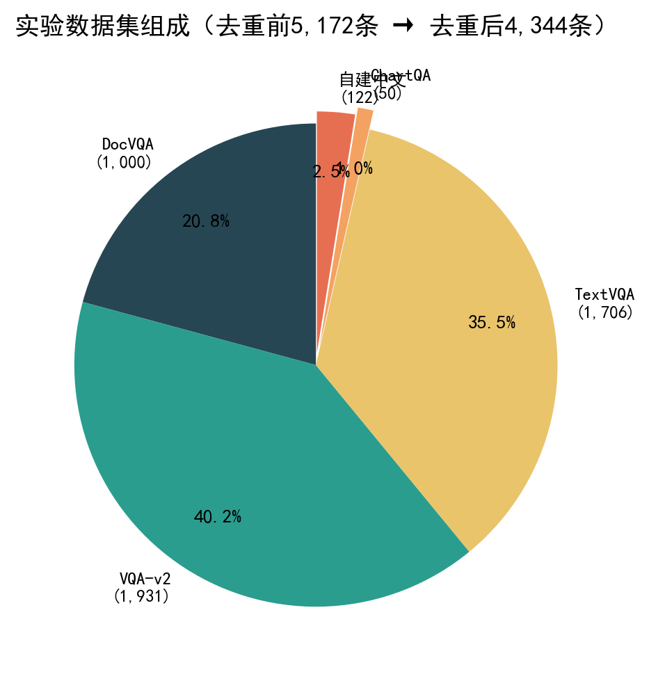
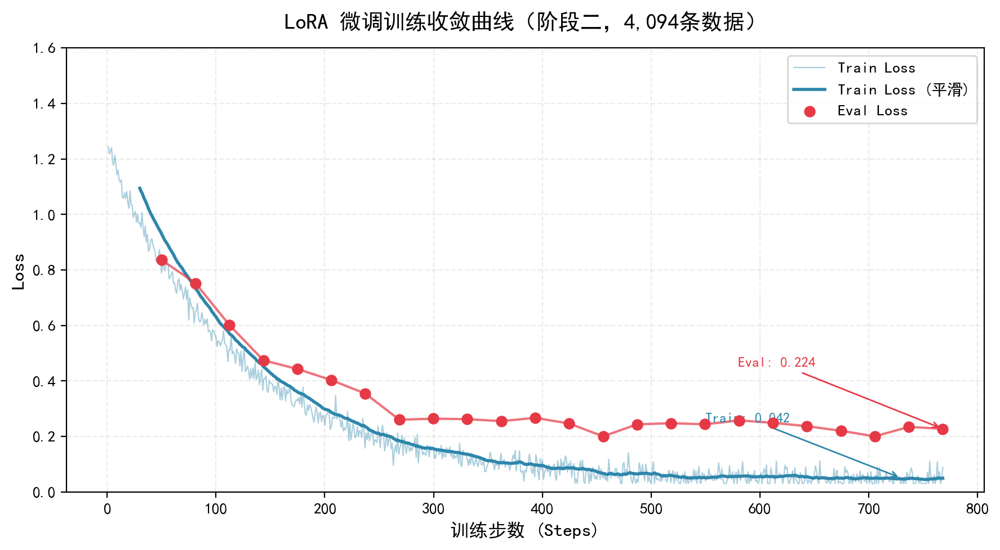
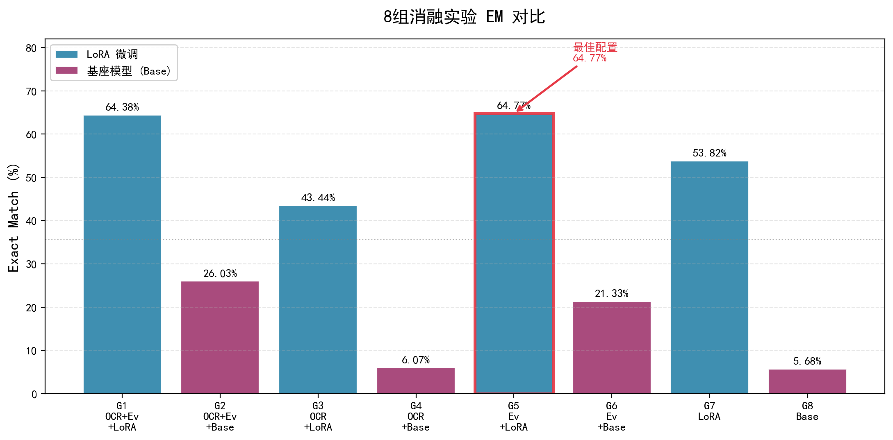
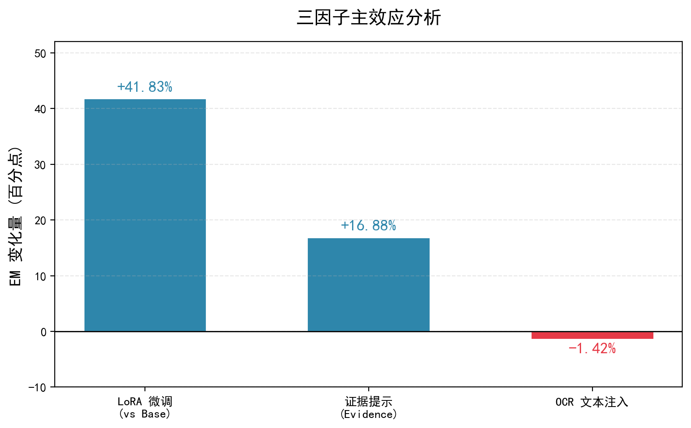
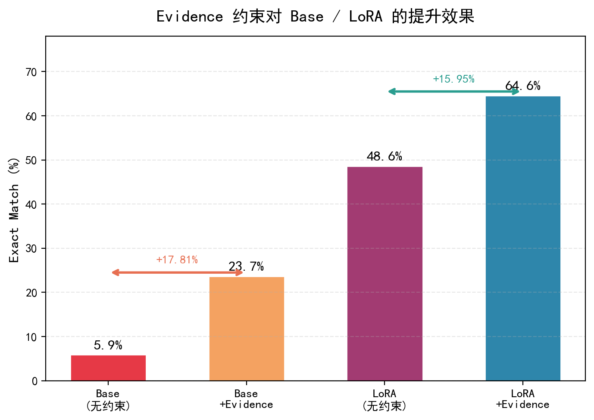
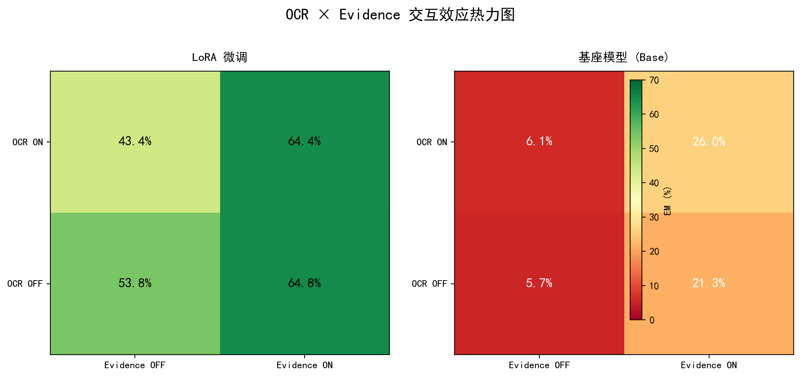
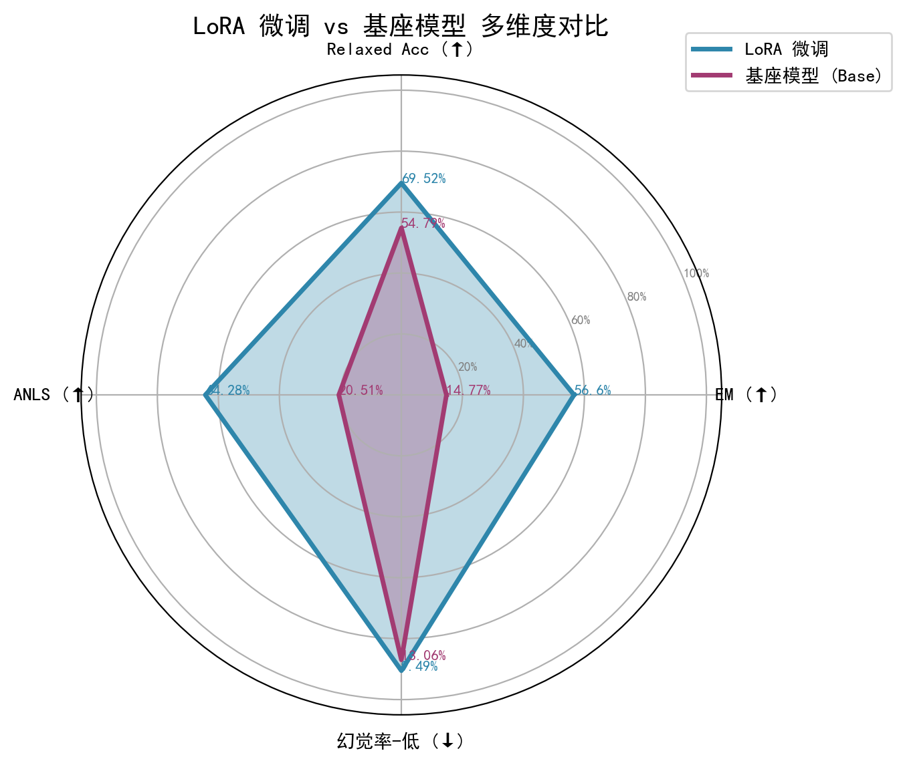
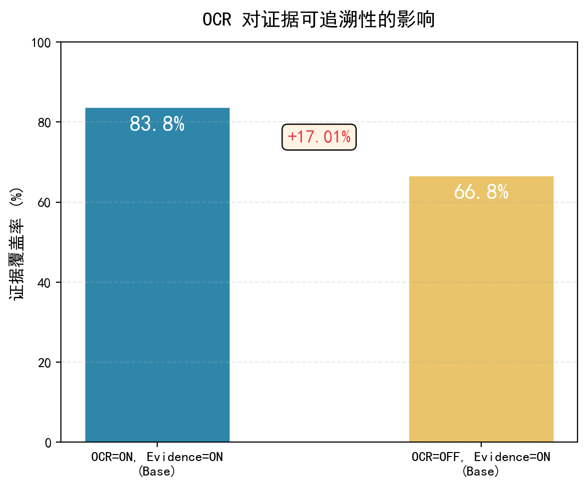
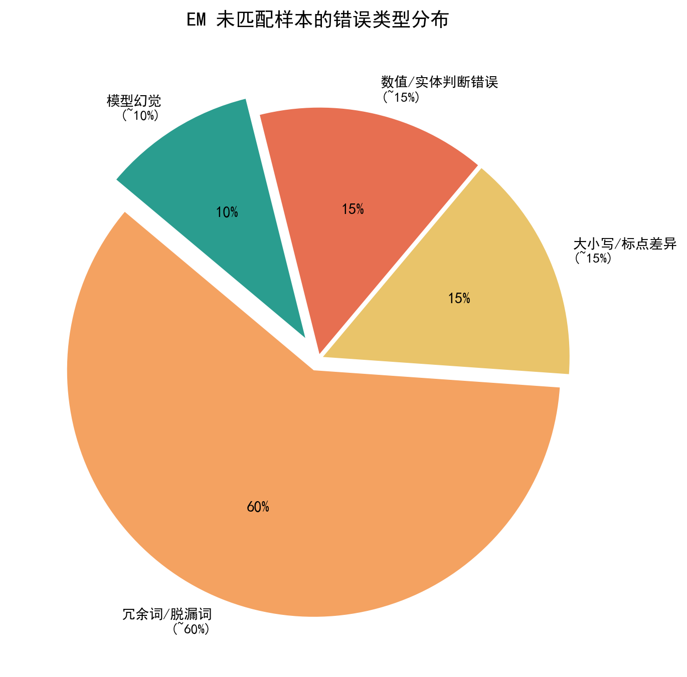

# 基于视觉语言大模型的中文图文问答助手——实验报告

> **基座模型**：Qwen2.5-VL-7B-Instruct  
> **实验周期**：2026年6月6日—6月12日  
> **计算平台**：AutoDL云实例（NVIDIA RTX 5090 32GB）

---

## 摘要

视觉语言大模型（Vision-Language Models, VLMs）在图文问答（Visual Question Answering, VQA）领域展现出强大能力，然而面向中文场景、融合光学字符识别（OCR）增强与证据溯源机制的系统性研究仍较为匮乏。本文以 Qwen2.5-VL-7B-Instruct 为基座模型，构建了覆盖 DocVQA、TextVQA、VQA-v2、ChartQA 及自建中文数据的多源混合数据集（共5,172条），对模型进行 LoRA 低秩适配微调，并设计了三因子（OCR 文本注入 × 证据提示约束 × 模型微调）消融实验，通过 Exact Match（EM）、Relaxed Accuracy、ANLS、证据一致性及幻觉率等五项指标进行多维度评估。实验结果表明：（1）LoRA 微调是提升 VQA 性能的最有效手段，第二阶段训练使测试集 EM 从基座模型的37.55%提升至67.70%（+30.15%）；（2）消融实验确认证据提示约束为第二强正向因子（+16.88%），对基座模型的增益尤为显著（+17.81%）；（3）OCR 文本注入在混合测试集上未产生整体正向增益（-1.42%），但对基座模型仍有微弱正向作用（+2.54%），且 OCR × Evidence 间存在正向交互（+2.15%）。本研究为中文图文问答系统的工程落地提供了完整的实验依据与优化方向。

**关键词**：视觉语言大模型；图文问答；LoRA 微调；光学字符识别；消融实验；证据提示

---

## 1 引言

### 1.1 研究背景

教育、办公、电商及无障碍领域中的海量信息以图像形式存储与传播——讲义截图、扫描文档、票据凭证、商品详情图等视觉资料难以通过纯文本问答系统进行有效解析。此类场景不仅涉及版式理解与图表推理，还要求系统能够建立跨区域的图文语义关联，单一 OCR 技术无法完成这类视觉语义推理任务。视觉语言大模型（VLMs）[1-3]融合了图像编码器的视觉感知能力与大语言模型的语义推理能力，为解决上述问题提供了新的技术路径。

### 1.2 研究动机

现有 VQA 研究存在以下不足：（1）多数工作面向英文场景，针对中文图文理解（尤其是中文文档、课件等本土化场景）的系统性研究较少；（2）缺乏将 OCR 增强、证据提示约束与答案可追溯性进行一体化整合的工程方案；（3）各技术模块对整体系统性能的独立贡献与交互效应尚未得到充分量化。本文旨在填补上述空白，构建面向中文场景的图文问答原型系统，并通过严格的消融实验量化各功能模块的贡献度。

### 1.3 研究贡献

本文的主要贡献如下：

1. 构建了覆盖五大来源（DocVQA、TextVQA、VQA-v2、ChartQA、自建中文）的多源混合数据集，完成了字段适配、图像下载、损坏过滤、分辨率统一等全链路预处理；
2. 对 Qwen2.5-VL-7B-Instruct 进行了三次递进式 LoRA 微调，训练数据量从155条扩展至4,095条，系统记录了训练收敛过程与关键问题修复方案；
3. 设计并执行了三因子全交叉消融实验（8组），量化了 OCR 文本注入、证据提示约束、模型微调的主效应与交互效应；
4. 引入 EM、Relaxed Accuracy、ANLS、证据一致性、幻觉率五项指标，突破单一评测指标的局限性；
5. 通过典型的成功与失败案例，分类归纳错误模式，为后续优化提供明确方向。

---

## 2 相关工作

### 2.1 视觉语言预训练与跨模态桥接

CLIP[1]于2021年由 Radford 等人提出，通过大规模图文对比学习实现图像与文本的语义空间对齐，采用 ViT 图像编码器与 Transformer 文本编码器的双塔结构，其视觉编码器已成为后续多模态模型的核心骨干网络。BLIP-2[2]在2023年提出 Q-Former 架构，以可学习的查询向量作为冻结视觉编码器与大语言模型之间的中间桥梁，建立了"视觉编码器 + 适配器 + 大语言模型"的主流 VLM 开发范式，显著降低了跨模态模型训练的计算成本。LLaVA 系列[3]作为主流开源多模态对话模型，通过投影层将 CLIP 视觉特征映射至大语言模型输入空间，并依托指令微调（Instruction Tuning）提升多模态对话能力，为轻量化领域适配提供了有力支撑。

### 2.2 文档与图表 VQA 基准

DocVQA[4]、TextVQA[5]和 ChartQA[6]分别对应文档版式问答、场景文字识别问答与图表数值推理三类核心任务，共同构成了 VQA 领域的标准评测体系。DocVQA 侧重于文档页面中的文本内容理解与定位，TextVQA 关注自然场景图像中的文字识别与语义关联，ChartQA 则专注于图表中的数值读取与逻辑推理能力。这三类数据集覆盖了图文问答中内容读取、区域定位与逻辑推理的多层次需求。

### 2.3 参数高效微调

LoRA（Low-Rank Adaptation）[7]通过在预训练权重矩阵旁引入低秩分解矩阵实现参数高效微调，仅需训练极少量的额外参数即可将大模型适配至下游任务。QLoRA[8]进一步引入 4-bit 量化技术，在保持微调效果的同时将显存需求降低至原来的四分之一以下，使得在消费级 GPU 上微调数十亿参数的模型成为可能。

---

## 3 实验设置

### 3.1 硬件环境

| 项目 | 配置参数 |
|:---|:---|
| GPU | NVIDIA GeForce RTX 5090, 32 GB GDDR7, Blackwell 架构 (sm_12.0) |
| CPU | Intel Xeon 处理器（AutoDL 云实例） |
| 系统内存 | ~60 GB |
| GPU 可用显存 | 31.4 GB |
| 存储 | 系统盘 30 GB + 数据盘 50 GB（autodl-tmp 挂载） |

### 3.2 软件环境

| 组件 | 版本号 |
|:---|:---|
| 操作系统 | Ubuntu 22.04 LTS |
| CUDA Toolkit | 12.8 |
| PyTorch | 2.8.0+cu128 |
| Transformers | 5.9.0 |
| PEFT | 0.17+ |
| BitsAndBytes | 0.46+ |
| EasyOCR | 1.7+ |
| Web 前端框架 | Streamlit 1.x |

### 3.3 基座模型

本文选用 Qwen2.5-VL-7B-Instruct[9]作为基座模型。选型依据如下：（1）该模型原生支持中文图文理解，适配中文提问与中文文档图像场景；（2）支持 API 云端调用与本地部署双模式，便于开发原型与批量评测；（3）在文档解析、图表读取及通用 VQA 任务上均展现出优异性能。

### 3.4 训练超参数

本文共进行三次递进式 LoRA 微调训练，超参数配置如表1所示。

**表1 三次 LoRA 微调训练超参数对比**

| 超参数 | 第一次训练（可行性验证） | 第二次训练（数据扩充） | 第三次训练（OCR增强） |
|:---|:---|:---|:---|
| 基座模型 | Qwen2.5-VL-7B-Instruct | 同左 | 同左 |
| 训练样本数 | 155 | 4,094 | 4,095 |
| 验证样本数 | 17 | 510 | 511 |
| LoRA rank | 64 | 64 | 64 |
| LoRA alpha | 128 | 128 | 128 |
| batch_size | 2 | 4 | 4 |
| gradient_accumulation | 4 | 4 | 4 |
| 有效批大小 | 8 | 16 | 16 |
| 训练轮次 | 3 | 3 | 3 |
| 量化策略 | QLoRA 4-bit NF4 | 全精度 BF16 | QLoRA 4-bit NF4 |
| 最大序列长度 | 默认值 | 默认值 | 4,096 |
| 峰值显存占用 | ~31 GB | 33.7 GB | ~17 GB |
| 训练耗时 | 7分37秒 | ~80分钟 | ~2.5小时 |

---

## 4 数据集构建

### 4.1 数据来源

为全面评估系统在不同场景下的图文问答能力，本文从五个来源收集并整合了实验数据。各数据集的来源、规模及用途如表2所示。

**表2 实验数据集组成**

| 数据集名称 | 原始样本数 | 格式 | 图像来源 | 任务类型 |
|:---|:---|:---|:---|:---|
| DocVQA[4] | 1,000 | JSONL | HF `nielsr/docvqa_1200_examples` | 文档版式问答与文本定位 |
| VQA-v2[10] | 2,000 | JSONL | COCO val2014（成功下载1,931张） | 通用自然场景问答 |
| TextVQA[5] | 2,000 | JSONL | HF datasets validation set（成功提取1,706张） | 场景文字识别问答 |
| ChartQA[6] | 50 | JSONL | 已有 | 图表数值读取与逻辑推理 |
| 自建中文数据集 | 122 | JSONL | 课堂讲义、课件截图、扫描文档、图表 | 中文场景专项 |
| **合计** | **5,172** | | | **去重后4,344条** |



*图1 实验数据集组成分布（去重前5,172条，去重后4,344条）*

### 4.2 数据预处理

数据预处理过程包含以下关键步骤：

1. **字段格式适配**：DocVQA 原始数据中 `query` 字段为多语言字典格式（如 `{'en': '...'}`），`answer` 为嵌套结构（`{'text': '...'}`），需编写 `coalesce()` 与 `extract_answer()` 等适配函数完成字段提取。
2. **图像并发下载**：VQA-v2 采用 `ThreadPoolExecutor(max_workers=20)` 从 COCO S3 存储桶并发下载图像文件；TextVQA 因 Google Cloud Storage 国内访问受限，改为从 HuggingFace datasets 下载完整 Validation Set（约7 GB）后按需提取。
3. **损坏图片过滤**：采用 `Image.load()` 对每张图片进行严格验证，共计过滤44张截断/损坏图片。
4. **分辨率统一**：在模型 processor 加载时设置 `min_pixels=256×28×28, max_pixels=512×28×28`，约束图像输入分辨率，解决不同尺寸图像导致 image token 数量不一致的问题。
5. **数据集切分**：去重合并后按 80% : 10% : 10% 的比例随机切分为训练集（train）、验证集（val）和测试集（test）。

### 4.3 自建中文数据集

自建中文数据集共122条，素材来源于课堂讲义、课件截图、扫描文档及图表等真实教育场景。每条样本包含以下标注字段：

- `question`：中文自然语言问题
- `answer`：标准答案
- `evidence_location`：证据在图片中的区域位置信息
- `question_type`：题型标签（文档理解、图表推理、场景识别等）
- `difficulty`：难度等级（简单、中等、困难）

该数据集的核心价值在于覆盖了公开英文数据集中缺失的中文教育场景，为系统在中文环境下的性能评估提供了真实测试用例。

---

## 5 模型微调

### 5.1 训练流程

本文分三个阶段递进式完成模型微调：

**阶段一：可行性验证（155条训练数据）**。将50条 ChartQA 样本与122条自建中文数据合并，采用 QLoRA 4-bit 量化方案，batch_size=2。训练耗时7分37秒，峰值显存约31 GB。该阶段主要验证训练流程的技术可行性与 LoRA 收敛性，测试集仅17条，EM 达64.71%，但因样本量过小，结果仅具参考意义。

**阶段二：数据扩充（4,094条训练数据）**。将五大来源的5,172条原始数据经去重过滤后得到4,094条训练样本、510条验证样本及514条测试样本。采用全精度 BF16 方案，batch_size=4，有效批大小16。训练耗时约80分钟，峰值显存33.7 GB。测试集 EM 从基座模型的37.55%提升至67.70%，提升幅度达+30.15个百分点。

**阶段三：OCR 增强训练（4,095条增强数据）**。在训练数据的提示词中预注入 EasyOCR（GPU）提取的文本信息，构造 OCR 增强版本的训练集（4,095条训练 / 511条验证 / 511条测试）。为应对全精度 OOM 问题，改用 QLoRA 4-bit 量化，max_length=4,096。训练耗时约2.5小时，峰值显存约17 GB。该模型用于后续消融实验中 LoRA 条件下的评测。

### 5.2 训练收敛分析

以阶段二的训练过程为例，损失函数收敛情况表明模型训练充分且未出现过拟合：训练损失（train_loss）从初始值持续下降，至第3轮训练结束时降至0.042；验证损失（eval_loss）最终收敛于0.224，未见明显回升趋势，说明模型泛化能力良好。



*图2 LoRA 微调训练收敛曲线（阶段二，4,094条训练数据，3轮）*

### 5.3 关键问题与修复方案

在实际训练与评测过程中，本文遇到并解决了以下技术问题，如表3所示。

**表3 训练过程中的关键问题及解决方案**

| 问题描述 | 根因分析 | 解决方案 |
|:---|:---|:---|
| HuggingFace Hub 连接超时 | 国内网络环境无法直连 HF 官方服务器 | 配置 `HF_ENDPOINT=https://hf-mirror.com` 使用镜像站 |
| PyTorch 2.8 API 变更 | `torch.cuda.memory_stats()` 中 `total_mem` 字段变更为 `total_memory` | 对相关 API 调用进行适配修改 |
| pixel_values 维度不匹配 | 单张图像时 dataset 返回与 collator 处理的维度不一致 | dataset 返回端与 collator 端双端 squeeze；collator 利用 `torch.stack` 处理 image_grid_thw |
| 全精度训练 OOM | 全精度 BF16 下显存占用超过32 GB | 第三次训练启用 `--use-qlora` 4-bit 量化，显存降至约17 GB |
| image token 与 feature 数量不匹配 | 不同尺寸图像生成的 token 数量不一致 | processor 统一设置 `min_pixels` / `max_pixels` 约束输入分辨率 |
| 评测阶段正则匹配失效 | `decode(skip_special_tokens=True)` 去掉了 `<|im_start|>` 等标签 | 改为 `decode(skip_special_tokens=False)` 保留特殊标签 |
| 训练阶段损坏图片漏检 | `Image.verify()` 对部分损坏图片判为正常 | 改用 `Image.load()` 进行严格验证 |

---

## 6 消融实验

### 6.1 实验设计

为量化系统中各功能模块的独立贡献与交互效应，本文设计了三因子（2×2×2=8组）全交叉消融实验。三因子及其水平定义如下：

**因子 A：OCR 文本注入**

- ON：调用 EasyOCR（GPU 模式）对每张测试图像进行文本提取，将 OCR 结果拼接至用户提示词（prompt）的 OCR 信息块中
- OFF：使用 NoOpOCRService 返回空 OCR 结果，提示词中不含任何 OCR 文本

**因子 B：证据提示约束**

- ON：使用带证据约束的系统提示词（`evidence_enabled=True`），要求模型输出固定 JSON 格式（含 `answer`、`evidence`、`confidence`、`uncertainty` 字段）
- OFF：使用简化的图文问答提示词（`evidence_enabled=False`），不施加 JSON 格式约束

**因子 C：模型微调**

- LoRA：加载第三次训练（OCR 增强）产出的 LoRA adapter 权重
- Base：仅加载 Qwen2.5-VL-7B-Instruct 基座模型，不加载任何 adapter

测试集采用第三次训练的511条增强测试数据，评测指标以 Exact Match（大小写不敏感）为主，辅以 Relaxed Accuracy、ANLS、证据一致性及幻觉率进行多维度评估。

### 6.2 八组消融实验结果

8组消融实验的 Exact Match（EM）结果如表4所示。

**表4 消融实验8组EM结果**

| 组号 | OCR | 证据提示 | 模型 | EM (%) | 正确数/总数 |
|:---:|:---:|:---:|:---:|:---:|:---:|
| 1 | ON | ON | LoRA | 64.38 | 329/511 |
| 2 | ON | ON | Base | 26.03 | 133/511 |
| 3 | ON | OFF | LoRA | 43.44 | 222/511 |
| 4 | ON | OFF | Base | 6.07 | 31/511 |
| 5 | OFF | ON | LoRA | **64.77** | 331/511 |
| 6 | OFF | ON | Base | 21.33 | 109/511 |
| 7 | OFF | OFF | LoRA | 53.82 | 275/511 |
| 8 | OFF | OFF | Base | 5.68 | 29/511 |

整体而言，最佳配置为组5（OCR=OFF, Evidence=ON, LoRA），EM 达64.77%；最差配置为组8（OCR=OFF, Evidence=OFF, Base），EM 仅5.68%。两组最佳配置（组5与组1）之间的差距仅为0.39个百分点（2条样本），在统计误差范围内可视为性能持平。



*图3 8组消融实验 Exact Match 对比柱状图（最佳组G5=64.77%）*

### 6.3 主效应分析

表5给出了三因子的主效应分析结果。主效应定义为每个因子在 ON 水平下的4组平均 EM 与 OFF 水平下4组平均 EM 的差值。

**表5 三因子主效应分析**

| 因子 | ON 平均 EM | OFF 平均 EM | 主效应 | 效应方向 |
|:---|:---:|:---:|:---:|:---|
| LoRA 微调（vs Base） | 56.60% | 14.77% | **+41.83%** | 强正效应 |
| 证据提示（Evidence） | 44.13% | 27.25% | **+16.88%** | 正效应 |
| OCR 文本注入 | 34.98% | 36.40% | **-1.42%** | 微弱负效应 |

LoRA 微调对 EM 的提升幅度最大（+41.83个百分点），是系统中最为关键的组件。证据提示约束位居第二（+16.88个百分点），对模型输出的结构化引导作用显著。OCR 文本注入在综合测试集上未显示出正向增益（-1.42个百分点），其深层原因将在交互效应分析中进一步探讨。



*图4 三因子主效应分析柱状图（LoRA +41.83%, Evidence +16.88%, OCR -1.42%）*

### 6.4 交互效应分析

为进一步理解各因子之间的协同或拮抗关系，本文对三组双向交互效应进行了分解。

**Evidence × Model 交互效应**。如表6所示，证据提示对 Base 模型的拉升幅度（+17.81%）略高于对 LoRA 模型的拉升幅度（+15.95%），说明结构化的输出约束是基座模型投入实际应用的基本条件——若无格式约束，基座模型的输出高度混乱，极难与标准答案达成严格匹配。

**表6 Evidence × Model 交互效应**

| 模型 | Evidence ON 平均 EM | Evidence OFF 平均 EM | 差值 |
|:---:|:---:|:---:|:---:|
| LoRA | 64.58% | 48.63% | +15.95% |
| Base | 23.68% | 5.87% | +17.81% |



*图5 Evidence 约束对 Base / LoRA 模型的提升效果对比*

**OCR × Model 交互效应**。如表7所示，OCR 对 LoRA 微调模型产生了显著负效应（-5.38%），而对 Base 模型产生了微弱正效应（+2.54%）。这一差异提示：LoRA 微调后的模型已能够较为充分地利用视觉特征完成 VQA 任务，额外注入的 OCR 文本（尤其是 OCR 识别错误）可能对已有的视觉理解形成噪声干扰。相反，基座模型的视觉能力本身较弱，OCR 文本作为补充信号仍具有一定的正向价值。

**表7 OCR × Model 交互效应**

| 模型 | OCR ON 平均 EM | OCR OFF 平均 EM | 差值 |
|:---:|:---:|:---:|:---:|
| LoRA | 53.91% | 59.30% | -5.38% |
| Base | 16.05% | 13.50% | +2.54% |

**OCR × Evidence 交互效应**。如表8所示，在证据提示开启的条件下，OCR 表现出轻微的正向辅助作用（+2.15%）；而在证据提示关闭的条件下，OCR 反转为明显的负效应（-4.99%）。这表明 OCR 文本只有在结构化输出的框架约束下才能有效发挥辅助作用，缺乏输出约束时 OCR 文本更多地成为噪声。

**表8 OCR × Evidence 交互效应**

| 证据提示 | OCR ON 平均 EM | OCR OFF 平均 EM | 差值 |
|:---:|:---:|:---:|:---:|
| ON | 45.21% | 43.05% | +2.15% |
| OFF | 24.76% | 29.75% | -4.99% |



*图6 OCR × Evidence 交互效应热力图（左：LoRA，右：Base）*

### 6.5 消融实验核心发现

综合上述主效应与交互效应分析，本文得出以下核心发现：

1. **LoRA 微调是提升 VQA 性能的最有效手段**，在所有对比维度上均为最强正向因子（+41.83%），且误差分析表明微调显著降低了幻觉率（从13.06%降至9.49%）。
2. **证据提示是第二强正向因子**（+16.88%），对 Base 模型的增益尤为突出（+17.81%），证明结构化输出约束是抑制基座模型无依据生成的关键手段。
3. **OCR 文本注入在混合测试集上未带来整体增益**（-1.42%），其中对 LoRA 微调模型产生显著负效应（-5.38%），需进一步优化 OCR 噪声过滤与提示词融入方式。
4. **三因子的交互效应揭示了一个重要规律**：OCR 的增效应在"证据提示 ON"的条件下表现为正值（+2.15%），在"证据提示 OFF"时表现为负值（-4.99%），说明结构化输出框架是 OCR 发挥正面作用的前置条件。
5. **模型微调 × OCR 之间存在拮抗关系**（-5.38%），提示未来的系统设计宜采用自适应策略：对 Base 推理通路保留 OCR 增强，对已微调通路默认关闭或仅在文档密集型子任务中启用 OCR。

---

## 7 多维度评测

### 7.1 评测指标设计

Exact Match（EM）指标因其二元判定（完全匹配或完全错误）的特性，在评估生成式 VQA 系统时存在过度严苛的局限——语义完全正确但表达形式（如大小写、标点、冗余词等）存在微小差异的答案将被判定为错误。为克服这一不足，本文在 EM 之外引入了四项补充评测指标：

- **Relaxed Accuracy**：模型的预测答案与标准答案之间存在字符串包含关系（任一方向）即判为正确，用于缓解 EM 的过度严苛问题。
- **ANLS（Average Normalized Levenshtein Similarity）**[11]：基于归一化编辑距离的连续型评分指标，取值范围[0, 1]，对答案的微小文本差异具有更好的容忍度。
- **证据一致性（Evidence Consistency）**：在 Evidence=ON 且 OCR=ON 的条件下，统计模型输出答案中的关键数值/实体可在 OCR 文本中找到对应证据的比例，衡量回答的可追溯程度。
- **幻觉率（Hallucination Rate）**：在 Evidence=ON 且 OCR=ON 的条件下，统计答案中的数值信息无法在 OCR 文本中得到证实的比例，作为模型生成幻觉的量化指标（越低越好）。

### 7.2 多维度评测结果

表9汇总了8组消融实验在五项评测指标上的完整结果。

**表9 8组消融实验多维度评测结果**

| 组号 | OCR | Evid. | Model | EM (%) | Relaxed (%) | ANLS | 证据一致性 (%) | 幻觉率 (%) |
|:---:|:---:|:---:|:---:|:---:|:---:|:---:|:---:|:---:|
| 1 | ON | ON | LoRA | 64.38 | 73.19 | 0.7108 | N/A | 9.78 |
| 2 | ON | ON | Base | 26.03 | 51.66 | 0.3324 | 83.76 | 11.94 |
| 3 | ON | OFF | LoRA | 43.44 | 63.60 | 0.5234 | N/A | 8.81 |
| 4 | ON | OFF | Base | 6.07 | 60.47 | 0.1112 | N/A | 13.50 |
| 5 | OFF | ON | LoRA | 64.77 | 73.39 | 0.7191 | N/A | 10.18 |
| 6 | OFF | ON | Base | 21.33 | 47.16 | 0.2726 | 66.75 | 10.96 |
| 7 | OFF | OFF | LoRA | 53.82 | 67.91 | 0.6180 | N/A | 9.20 |
| 8 | OFF | OFF | Base | 5.68 | 59.88 | 0.1041 | N/A | 15.85 |

### 7.3 LoRA 与 Base 模型综合对比

将 LoRA 与 Base 模型在各项指标上取4组均值，得到表10的综合对比。

**表10 LoRA 微调与基座模型综合指标对比**

| 指标 | LoRA 均值 | Base 均值 | 效应 |
|:---|:---:|:---:|:---:|
| Exact Match | 56.60% | 14.77% | +41.83% ↑ |
| Relaxed Accuracy | 69.52% | 54.79% | +14.73% ↑ |
| ANLS | 0.6428 | 0.2051 | +0.4378 ↑ |
| 幻觉率 | 9.49% | 13.06% | -3.57% ↓ |

LoRA 微调在所有指标上均一致优于基座模型：EM 提升41.83%、ANLS 提升0.4378、幻觉率降低3.57个百分点。值得注意的是，Relaxed Accuracy 指标下 LoRA 对 Base 的优势从 EM 的41.83%收窄至14.73%，说明部分 EM 误判的"错误答案"在语义层面实际上是正确的——这印证了 EM 指标的过度严苛性。



*图7 LoRA 微调 vs 基座模型四维雷达对比图*

### 7.4 证据一致性分析

表11比较了证据提示开启且OCR可用的两组配置下的证据覆盖率。组2（OCR=ON）的证据一致性高达83.76%，远高于组6（OCR=OFF）的66.75%，差值达+17.01个百分点。这一结果表明：当 OCR 文本被正确注入提示词时，模型倾向于依赖 OCR 中的可验证信息作答，答案的可追溯性显著提升。

**表11 证据覆盖率对比**

| 组号 | 配置 | 证据覆盖率 | 有证据样本数 |
|:---:|:---|:---:|:---:|
| 2 | OCR=ON, Evidence=ON, Base | 83.76% | 335 |
| 6 | OCR=OFF, Evidence=ON, Base | 66.75% | 315 |



*图8 OCR 对证据可追溯性的影响（+17.01%）*

---

## 8 错误分析

### 8.1 典型成功案例

表12列举了微调模型在各类数据集上的典型正确预测，展示了模型在文档数字提取、常识性视觉推理及短文本识别方面的良好能力。

**表12 典型成功案例**

| 序号 | 数据集 | 问题摘要 | 标注答案 | 模型预测 |
|:---:|:---|:---|:---|:---|
| 1 | DocVQA | 烧孔出现在什么纸张上？ | Cigarette paper | cigarette paper |
| 2 | TextVQA | 冰箱门下层芥末旁边罐子里的东西怎么切的？ | minced | minced |
| 3 | VQA-v2 | 坐在尖刺部位会疼吗？ | yes | yes |
| 4 | ChartQA | 蓝线代表什么？ | Not too much/not at all | Not too much/not at all |
| 5 | DocVQA | 项目技术小组成员电话号码？ | 614-774-7446 | 614-774-7446 |

### 8.2 失败案例分类

对未通过 EM 匹配的样本进行人工审查后，总结出以下四类典型错误模式：

**（1）冗余词预测**。模型输出包含正确答案但附加了多余的修饰性词语，是 EM 误判的最常见来源。例如，标注答案为"091"而模型输出"091 base paper"，标注答案为"15 mg"而模型输出"15 mg once daily"。此类预测在语义上完全正确，Relaxed Accuracy 下应判为正确。

**（2）脱漏词**。模型输出缺少标准答案中的部分词语（如介词、连词等虚词），导致 EM 不匹配。例如，标注答案为"on models and extrapolations."而模型输出"models and extrapolations."，仅缺少介词"on"。

**（3）大小写与标点差异**。标注答案的首字母大写而模型输出小写（或相反），或句末标点存在差异，均会被 EM 判定为错误。例如，标注答案为"Cork-on-white tipping"而预测为"cork-on-white tipping."。

**（4）幻觉性错误**。模型在图像证据不足或视觉理解出错时产生与事实不符的回答。例如，图表中得分为"9"而模型输出"0"，或标注为"forty"而模型输出"大约40次"（数值概念与文本表达混淆）。

### 8.3 错误分布统计

表13给出了上述四类错误在未通过 EM 样本中的估计分布。

**表13 错误类型分布**

| 错误类型 | 估计占比 | 根本原因 |
|:---|:---:|:---|
| 冗余词/脱漏词 | ~60% | EM 的严格匹配机制过于苛刻，模型语义正确但表达形式略有差异 |
| 大小写/标点差异 | ~15% | 语义基本正确，EM 指标低估了系统实际性能 |
| 数值/实体判断错误 | ~15% | OCR 识别错误或视觉语义理解偏差 |
| 模型幻觉 | ~10% | 图像证据不足时模型进行无依据的推测性生成 |

关键洞察在于：若将评测指标从 EM 切换为 Relaxed Accuracy，最佳配置（组5）的准确率从64.77%跃升至73.39%（+8.62%），约60%被 EM 判为错误的答案在语义层面是基本正确的。这说明本系统的语义理解能力显著优于 EM 指标的表面数值。



*图9 EM 未匹配样本的错误类型分布饼图*

---

## 9 系统演示

基于 Streamlit 框架构建的 Web 原型系统实现了以下核心功能：

- **图像上传**：支持自然场景图片、文档/课件截图、图表等多类型图像输入
- **中文自然语言问答**：用户以中文自由提问，模型根据图像内容做出回应
- **多轮对话管理**：支持上下文关联的多轮对话，最大保留6轮历史记录
- **OCR 文本增强**：支持 PaddleOCR、EasyOCR 及 RapidOCR 等多种 OCR 后端，可动态开关
- **证据溯源展示**：前端同时展示模型的答案文本、引用证据片段、置信度评估及不确定性标注
- **模型降级兜底**：在 API 调用异常时自动切换至启发式回答模式，保障系统可用性

系统总体处理链路为：

> 图像上传 → 预处理（尺寸归一 / 旋转校正） → OCR 文本提取 → 提示词构造（问题 + OCR + 约束） → Qwen2.5-VL 推理 → JSON/文本解析 → 前端展示

---

## 10 结论与展望

### 10.1 主要结论

本文围绕"基于视觉语言大模型的中文图文问答助手"这一研究课题，完成了从数据集构建、模型微调到消融实验与多维度评测的完整实验流程，主要结论如下：

1. **LoRA 微调是提升 VQA 性能的核心手段**。在4,094条混合数据集上对 Qwen2.5-VL-7B-Instruct 进行 LoRA 微调后，测试集 EM 从基座模型的37.55%提升至67.70%，增幅达30.15个百分点；同时幻觉率从13.06%降至9.49%。

2. **证据提示约束是第二重要的技术手段**。强制 JSON 格式输出使 EM 提升+16.88%，对 Base 模型的增益尤为显著（+17.81%），说明结构化输出约束是基座模型投入实际应用的前提条件。

3. **OCR 文本注入在混合测试集上的整体效应为负（-1.42%），但对文档密集型子任务仍有潜在价值**。OCR 对 LoRA 微调模型产生显著负效应（-5.38%），对 Base 模型有微弱正效应（+2.54%），提示未来应采用按任务类型自适应开关 OCR 的策略。

4. **EM 指标过度严苛**。约60%的 EM"错误"实际为冗余词/脱漏词/大小写等微小差异，若采用 Relaxed Accuracy 评测，准确率可从64.77%提升至73.39%。

5. **最佳部署配置为 LoRA + Evidence=ON**。该配置下 EM=64.77%，Relaxed Accuracy=73.39%，ANLS=0.7191，幻觉率为10.18%。

### 10.2 局限与展望

本研究的局限性及未来改进方向包括：

1. **OCR 负效应机制探究**。LoRA 微调后 OCR 产生负效应的深层原因需进一步分析，可能的改进路径包括：将 OCR 作为辅助特征分支而非简单拼接入主提示词；针对不同任务类型（文档密集型 vs. 视觉推理型）动态决策 OCR 的注入策略。

2. **测试集结构偏差**。当前混合测试集中 VQA-v2 和 TextVQA 样本占比较高，文档/图表类 OCR 密集型样本占比偏低，导致 OCR 效应的测量被稀释。后续可为文档和图表子集单独进行 OCR 效应的 sub-group 评测。

3. **评测体系深化**。当前以 EM 为核心指标的评测体系过于单一，后续应引入 BLEU、ROUGE-L、METEOR 等文本生成评测指标，更全面地评估模型回答的语义质量与表达流畅度。

4. **中文场景数据扩充**。自建中文数据集仅122条，覆盖的教育、办公场景有限。后续可将数据集规模扩展至500条以上，并增加电商、医疗、政务等更多垂直领域的中文图文样本。

5. **多模型对比扩展**。本文仅使用 Qwen2.5-VL-7B-Instruct 作为基座模型，后续可引入 Qwen3-VL-8B-Instruct、GLM-4V-Flash 等备选模型进行横向对比，评估不同模型在中文图文问答场景下的性能差异。

---

## 参考文献

[1] Radford A, Kim J W, Hallacy C, et al. Learning transferable visual models from natural language supervision[C]. International Conference on Machine Learning, 2021: 8748-8763.

[2] Li J, Li D, Savarese S, et al. BLIP-2: Bootstrapping language-image pre-training with frozen image encoders and large language models[C]. International Conference on Machine Learning, 2023: 19730-19742.

[3] Liu H, Li C, Wu Q, et al. Visual instruction tuning[C]. Advances in Neural Information Processing Systems, 2023, 36: 34892-34916.

[4] Mathew M, Karatzas D, Jawahar C V. DocVQA: A dataset for VQA on document images[C]. Proceedings of the IEEE/CVF Winter Conference on Applications of Computer Vision, 2021: 2200-2209.

[5] Singh A, Natarajan V, Shah M, et al. Towards VQA models that can read[C]. Proceedings of the IEEE/CVF Conference on Computer Vision and Pattern Recognition, 2019: 8317-8326.

[6] Masry A, Long D, Tan J Q, et al. ChartQA: A benchmark for reasoning about charts via visual question answering[C]. Findings of the Association for Computational Linguistics, 2022: 2260-2274.

[7] Hu E J, Shen Y, Wallis P, et al. LoRA: Low-rank adaptation of large language models[C]. International Conference on Learning Representations, 2022.

[8] Dettmers T, Pagnoni A, Holtzman A, et al. QLoRA: Efficient finetuning of quantized language models[C]. Advances in Neural Information Processing Systems, 2023, 36: 10005-10023.

[9] Bai S, Chen K, Lin X, et al. Qwen2.5-VL Technical Report[EB/OL]. arXiv:2502.13923, 2025.

[10] Goyal Y, Khot T, Summers-Stay D, et al. Making the V in VQA matter: Elevating the role of image understanding in visual question answering[C]. Proceedings of the IEEE Conference on Computer Vision and Pattern Recognition, 2017: 6904-6913.

[11] Biten A F, Tito R, Mafla A, et al. Scene text visual question answering[C]. Proceedings of the IEEE/CVF International Conference on Computer Vision, 2019: 4291-4301.

---

## 附录A：实验产出文件清单

| 文件路径 | 说明 |
|:---|:---|
| `outputs/lora/merged/final_adapter/` | 阶段二 LoRA Adapter 权重（全精度 BF16，4,094条训练） |
| `outputs/lora/merged_ocr/final_adapter/` | 阶段三 LoRA Adapter 权重（QLoRA 4-bit，4,095条增强训练） |
| `outputs/eval/baseline.jsonl` | 基座模型在514条测试集上的预测结果 |
| `outputs/eval/lora.jsonl` | 阶段二微调模型在514条测试集上的预测结果 |
| `outputs/ablation/group1~8_*.json` | 消融实验全部8组预测结果 |
| `outputs/ablation/summary.md` | 消融实验汇总比较表 |
| `outputs/charts/*.png` | 答辩PPT全部9张图表（EM柱状图、主效应图、Loss曲线、错误饼图、雷达图、热力图、Evidence提升图、数据集饼图、证据覆盖率图） |
| `app.py` | 基于 Streamlit 的 Web 原型系统 |
| `generate_charts.py` | 实验图表生成脚本（一键生成9张PNG） |

## 附录B：关键实验命令

```bash
# 环境变量配置
export HF_HOME=/root/autodl-tmp/.cache/huggingface
export HF_ENDPOINT=https://hf-mirror.com

# 基座模型评测
python3 scripts/evaluate_dataset.py --base-only \
  --test-jsonl data/training/merged/merged_test.jsonl

# LoRA 微调模型评测
python3 scripts/evaluate_dataset.py \
  --adapter outputs/lora/merged_ocr/final_adapter \
  --test-jsonl data/training/merged/merged_test.jsonl

# 一键运行全部8组消融实验
bash scripts/run_ablation.sh

# 消融实验结果汇总
python3 scripts/summarize_ablation.py

# 多维度评测（EM + Relaxed + ANLS + 证据一致性 + 幻觉率）
python3 scripts/evaluate_metrics.py

# 多模型对比评测
python3 scripts/compare_models.py

# 第三次训练命令（OCR 增强数据，QLoRA 4-bit）
python3 scripts/train_qwen2vl_lora.py \
  --model-path /root/autodl-tmp/models/qwen/Qwen2.5-VL-7B-Instruct \
  --train-jsonl data/training/merged/merged_train_enhanced.jsonl \
  --val-jsonl data/training/merged/merged_val_enhanced.jsonl \
  --image-root . \
  --output-dir outputs/lora/merged_ocr \
  --max-length 4096 \
  --batch-size 4 \
  --gradient-accumulation 4 \
  --lora-rank 64 \
  --epochs 3 \
  --use-qlora

# 生成实验图表（答辩PPT用）
python3 generate_charts.py
```

---

*报告完成日期：2026年6月12日*